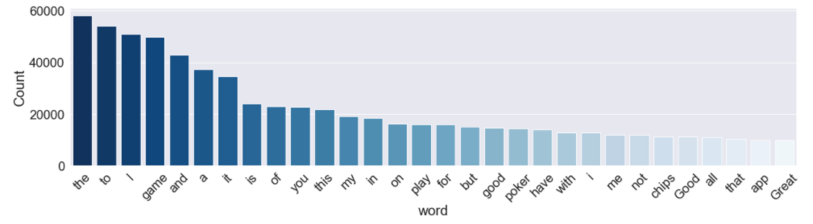
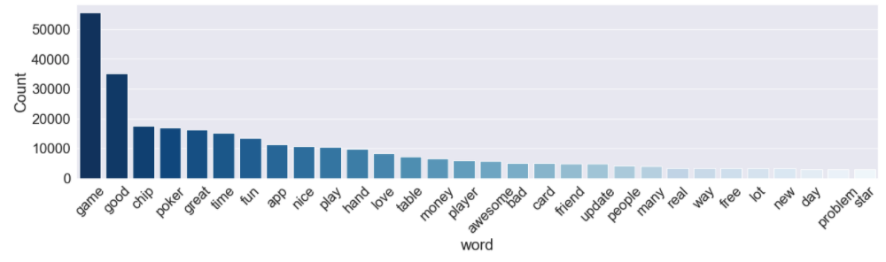
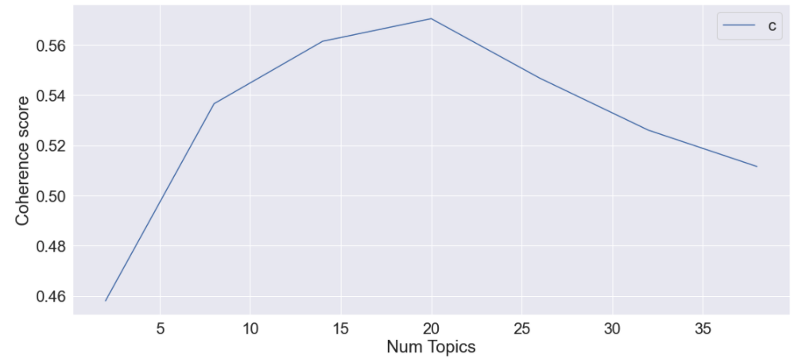
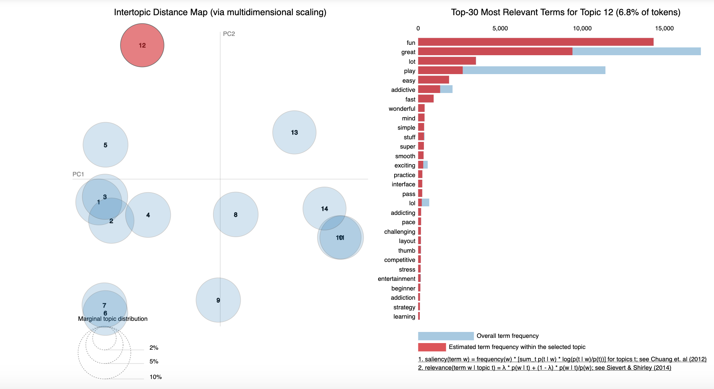

# Topic Modelling on Zynga Poker Game Reviews

The goal is to get more insights from app reviews to improve Zynga Poker and for consumers to be able to quickly extract key topics covered by the reviews without having to go through each one themselves. 

## Prerequisite

The notebooks, [`game_review_acquisition.ipynb`](https://github.com/georgethoraninh/absa_game_reviews/blob/master/notebooks/game_review_acquisition.ipynb) and [`topic_modelling.ipynb`](https://github.com/georgethoraninh/absa_game_reviews/blob/master/notebooks/topic_modelling.ipynb), are written in Python 3. The libraries that are used in these notebooks are listed under the `requirements.txt` file. One can simply issue the following command to ensure the proper libraries are installed:

```bash
pip3 install -r requirements.txt
```

## Background

Zynga Poker is designed to be played like a real table experience, this Texas Hold ‘Em Poker game lets players participate in Sit-N-Go or Spin & Win tournament modes or a cash table game to win generous payouts with up to nine players in either fast or slow style settings. Zynga Poker has developed a strong community within the game supported by Leagues and a VIP program. This allows players to earn benefits and features by reaching higher tiers with exclusive chip package offerings and special game modes. 

## Extracting Data from Google Play Store

We decided to use reviews from the Google Play Store because there were almost 2.5M ratings and reviews as opposed to the App store which only lists 6,600 ratings and reviews. Roughly 200,000 app reviews were extracted from the Google Play Store using this [scraper](https://github.com/JoMingyu/google-play-scraper) - provides APIs to crawl the Google Play Store using Python.

## Cleaning the textual data

The next step was to preprocess our reviews. Let's take a look at the most frequent words in our reviews.

Common words such as: to, I, the, it are not important for our task. Thus, we got rid of any unnecessary words. We also removed unwanted punctuations, emojis, stop words (e.g., the, to, and) and converted the text to lower case. 
After removing unnecessary text, we did tokenization which splits longer text into smaller pieces and lemmatized the tokens - to reduce inflectional forms to a common base form (e.g., studying -> study).

We now have more relevant terms we can use to build our topic model!

## Topic Model - Latent Dirichlet Allocation (LDA)
**What is a topic?**

A topic is a collection of dominant keywords that are typical representatives. By looking at the keywords, we can understand what the topic is.

**What is LDA?**

LDA maps all reviews to the topics in a way, such that the words in each review are mostly captured by the topics and their respective keywords.

We use the Gensim library for our LDA topic model. Gensim helps us also to create a corpus which will be the input for our model. A corpus in this case is a collection of words with an assigned ID and frequency of times the word appears in the reviews (e.g., Zynga, ID = 25, frequency = 200).

**How do we choose the optimal # of topics?**

We built multiple LDA models with different number of topics and chose the model with 14 topics with a coherence (convenient measure to assess how good a topic model is) score of 0.56. We can see the comparison of coherence scores:

Even though 20 topics had a slightly higher coherence score, we saw a large decrease after 20 topics. Thus, we decided to go with 14 topics which still had one of the highest coherence scores and was parsimonious to the number of topics.

We visualized the topics using the pyLDAvis library which helped interpret the topics from our topic model:

Each cicle is a different topic and the words on the right are the keywords that make up the topic. For example, the 12th topic (highlighted in red) provided us with the keywords: **fun, great, play, easy** which described the reviews as mainly positive and how people are enjoying the game. 

## Summary
The LDA topic model was optimized with 14 topics and was given Zynga Poker review data from the Google Play Store. We interpreted the results which lead to grouping the 14 subtopics into 3 main areas: 

1. Positive comments
    - Keywords: **fun, addictive, favorite, beautiful, graphic**
    - Sample reviews:
        - *This game continues to be my favorite app*
        - *I've been hooked since the first time I played, love winning*
        - *Very well done! The best online poker app IMO. Improvements are noted & appreciated.*
2. Blame the game 
    - Keywords: **player, bad, hand, fair, lose**
    - Most of these players who are giving poor reviews are losing and complaining how the game is ”rigged” – blaming on game’s algorithm
    - Losing to users called “Bingo Players”
        - I.e., Always going all-in pre-flop regardless of what is in their hand
3. Bugs & Fixes 
    - Keywords: **annoying, uninstall, update, fix, error**
    - There seem to issues with features in the game: league progress, free chip ads, free spins, event updates
    
Summary of the entire analysis was put together into a slide deck - [`zynga_poker_review_analysis.pdf`](https://github.com/georgethoraninh/absa_game_reviews/blob/master/slide_deck/zynga_poker_review_analysis.pdf)


